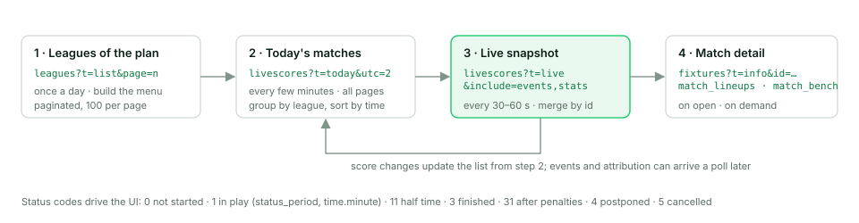

# Recipes

Step-by-step call sequences for the products most often built on SoccersAPI.
Every request needs `user` and `token`; the examples omit them. Times are UTC
unless you pass `utc`; see [Shared Query Parameters](./05-global-query-parameters.md).

Before any recipe, fetch the leagues your plan can read and keep the list:

```http
GET /v2.2/leagues/?t=list&page=1
```

It is paginated (100 per page, `meta.pages`), and it is the only reliable way
to know which competitions the account covers; every feed below is already
filtered to those leagues.

## Livescore screen

Plans: every plan for the feeds; `events` and `stats` need a Standard or World
Cup plan.



1. **Today's matches**, grouped by league. Page through `meta.pages`; a busy
   day has several hundred matches.

   ```http
   GET /v2.2/livescores/?t=today&utc=2&page=1
   ```

2. **Live loop.** Poll the live feed on a fixed cadence (30 to 60 seconds) and
   merge each snapshot into the list from step 1 by match `id`. Embedding the
   timeline and team statistics avoids extra calls per match.

   ```http
   GET /v2.2/livescores/?t=live&include=events,stats
   ```

3. **Match detail** when the user opens a match: one call with the datasets you
   show, plus lineups and bench on demand.

   ```http
   GET /v2.2/fixtures/?t=info&id=2589310&include=events,stats
   GET /v2.2/fixtures/?t=match_lineups&id=2589310
   GET /v2.2/fixtures/?t=match_bench&id=2589310
   ```

4. **Render state from `status`**, not from the scores: `0` not started, `1` in
   play with `status_period` (`1st Half`, `2nd Half`) and `time.minute`, `11`
   half time, `3` finished, `31` finished after penalties, `4` postponed, `5`
   cancelled. The full list is in [Statuses](./08-statuses.md).

5. **Details that make the screen look right**: `teams.home.kit_colors` for
   shirt colours, `coverage.has_lineups` to decide whether to show a lineups
   tab, `time.timestamp` to format the kickoff in the viewer's zone, and
   `scores.ht_score` / `ft_score` / `et_score` / `ps_score` for the period
   scores.

```js
const base = 'https://api.soccersapi.com/v2.2';
const auth = `user=${USER}&token=${TOKEN}`;

async function todayMatches(utc = 0) {
  const all = [];
  for (let page = 1, pages = 1; page <= pages; page++) {
    const res = await fetch(`${base}/livescores/?${auth}&t=today&utc=${utc}&page=${page}`);
    const body = await res.json();
    if (!res.ok) throw new Error(body.meta?.msg || body.message || res.status);
    all.push(...body.data);
    pages = body.meta.pages;
  }
  return all;
}

async function liveSnapshot() {
  const res = await fetch(`${base}/livescores/?${auth}&t=live&include=events,stats`);
  return (await res.json()).data;
}
```

```python
import requests

BASE = "https://api.soccersapi.com/v2.2"
AUTH = {"user": USER, "token": TOKEN}

def today_matches(utc=0):
    matches, page, pages = [], 1, 1
    while page <= pages:
        r = requests.get(f"{BASE}/livescores/", params={**AUTH, "t": "today", "utc": utc, "page": page}, timeout=15)
        body = r.json()
        if r.status_code != 200:
            raise RuntimeError(body.get("meta", {}).get("msg") or body.get("message") or r.status_code)
        matches += body["data"]
        pages = body["meta"]["pages"]
        page += 1
    return matches
```

## Where to watch

Plans: Standard, World Cup and Broadcast.

1. **Matches on TV for a date**, with the channels embedded in each match.
   Paginated like every feed.

   ```http
   GET /v2.2/broadcast/?t=schedule&d=2026-09-07&include=tvs&utc=2&page=1
   ```

   Each match carries `tvs[]` with `id`, `name`, `type` and `country`. Keep the
   channels whose `country.cc` matches the viewer's country.

2. **Channels of one match**, for a match page you already have from another
   feed. `broadcast?t=match_tvs` returns every channel worldwide with its
   country; `fixtures?t=info&include=broadcast` does the same inside the match
   object.

   ```http
   GET /v2.2/broadcast/?t=match_tvs&id=2589310
   GET /v2.2/fixtures/?t=info&id=2589310&include=broadcast
   ```

3. **Channel pages.** The channel catalogue by country, one channel's profile
   with its logo and website, and the matches it shows over the next two
   weeks.

   ```http
   GET /v2.2/broadcast/?t=list&country_id=15
   GET /v2.2/broadcast/?t=info&id=31
   GET /v2.2/fixtures/?t=tv&tv_id=31
   ```

4. **Fixture lists that already carry TV data.** If your product fetches
   fixtures anyway, add `include=broadcast` to `schedule`, `season`, `round`,
   `info` or `sort` instead of calling the broadcast route again.

`coverage.has_tvs` on a match tells you whether broadcast data exists for it,
so you can hide the "where to watch" block instead of showing it empty.

## Odds

Plans: Standard, World Cup and Odds. Odds are strings in the format selected
with `odds_format` (`decimal` by default, `fractional`, `american`).

1. **Pre-match odds for a list of matches**: embed them in the fixture list.

   ```http
   GET /v2.2/fixtures/?t=schedule&d=2026-09-07&include=odds_prematch
   ```

   `odds_prematch[]` has one entry per market (`1X2, Full Time Result`,
   `Over/Under, Goal Line`, `Asian Handicap`, and the first-half and corners
   variants) with `bookmakers[]`, each carrying `odds.data`: `home`, `draw`,
   `away` for 1X2, `over`, `under` and the `handicap` line for goal lines, and
   `last_update`.

2. **All odds of one match**, or the history of one bookmaker for it.

   ```http
   GET /v2.2/fixtures/?t=match_odds&id=2589310
   GET /v2.2/fixtures/?t=match_odds_info&id=2589310&bookmaker_id=1
   ```

3. **In-play odds** on the live feed or on a match detail. Each entry reports
   the `score` and `minute` the price refers to, so you can discard stale
   quotes.

   ```http
   GET /v2.2/livescores/?t=live&include=odds_inplay
   GET /v2.2/fixtures/?t=match_oddsinplay&id=2589310
   ```

4. **Catalogues** for logos and market names.

   ```http
   GET /v2.2/bookmakers/?t=list
   GET /v2.2/markets/?t=list
   ```

Odds coverage varies by match and bookmaker; treat an empty `bookmakers[]` as
"no price yet", not as an error.

## Competition page

Plans: Standard and World Cup for standings, leaders and statistics; every plan
for the rest.

```http
GET /v2.2/leagues/?t=info&id=594                  # profile, seasons, current season/stage/round
GET /v2.2/seasons/?t=info&id=21268                # dates, stages, round ids
GET /v2.2/leagues/?t=standings&season_id=21268    # table; standings_live while matches are in play
GET /v2.2/rounds/?t=byseason&season_id=21268      # match days, is_current flag
GET /v2.2/fixtures/?t=round&round_id=217291       # fixtures of one match day
GET /v2.2/fixtures/?t=season&season_id=21268      # whole season in one response
GET /v2.2/leaders/?t=topscorers&season_id=21268   # also topassists, topcards
GET /v2.2/stats/?t=season&id=21268                # season totals
```

Standing rows carry `overall`, `home` and `away` records, `status` (zone label
such as `Promotion` or `Relegation`), `result` (for example `Champions League`)
and `recent_form`. Competitions with several tables return one row per table,
identified by `group`, and `number_standings` says how many there are.

## Team page

```http
GET /v2.2/teams/?t=info&id=111                    # profile, kit colours, coach_id, venue_id, current seasons
GET /v2.2/teams/?t=squad&id=111                   # current squad; add season_id for a past season
GET /v2.2/fixtures/?t=last_next&team_id=111       # last results, matches in play, next fixtures
GET /v2.2/h2h/?t=teams&team1=111&team2=98         # head to head with form
GET /v2.2/stats/?t=team&id=111&season_id=21268    # season statistics
GET /v2.2/venues/?t=info&id=1446                  # stadium from venue_id
GET /v2.2/coaches/?t=info&id=5992                 # coach from coach_id
```

Squads, sidelined players, transfers and trophies need a Standard or World Cup
plan; profiles, lists and fixtures are available on every plan.
