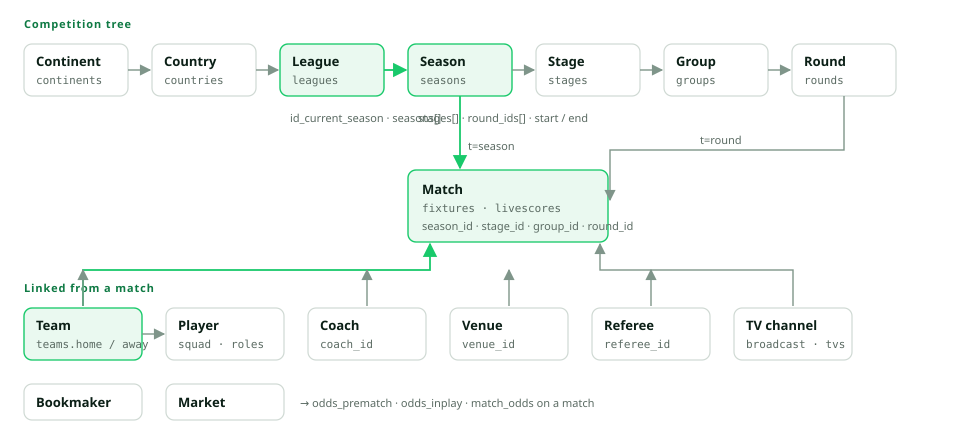

# Data Model

How the entities relate, which field carries which identifier, and the
conventions shared by every response.

## Entities and how they link

| From | Field | Leads to |
| --- | --- | --- |
| League (`leagues?t=info`) | `seasons[].id`, `id_current_season`, `id_current_stage`, `id_current_round` | Season, stage and round to query next. |
| Season (`seasons?t=info`) | `league_id`, `stages[]`, `round_ids[]`, `current_round_id`, `current_stage_id`, `start`, `end` | Stages carry `has_standings` and `has_cupdraw`; rounds are the match days. |
| Match | `league.id`, `season_id`, `stage_id`, `group_id`, `round_id`, `teams.home.id`, `teams.away.id`, `venue_id`, `referee_id`, `teams.*.coach_id`, `aggregate_id`, `related_id` | Every other resource of the match. |
| Team (`teams?t=info`) | `current_seasons[]`, `leagues[].current_season_id`, `coach_id`, `venue_id` | Seasons to query for fixtures and standings. |
| Player (`players?t=info`) | `team_id`, `national_team_id`, `roles[].team.id`, `leagues[].seasons[]` | Current and past teams and competitions. |
| Broadcast | `tvs[].id`, `broadcast[].id` | Channel profile (`broadcast?t=info`) and its fixtures (`fixtures?t=tv`). |

Seasons are the pivot of the model: fixtures, standings, teams, leaders and
season statistics are all keyed by `season_id`. A league profile gives you the
current one; `seasons[]` on the same profile gives you the history, newest
first.

## Identifiers

- IDs are stable and unique per entity type. Reuse them across routes: a
  `team_id` from a match is the `id` for `teams?t=info`.
- The same ID can be serialised as a number or as a numeric string depending
  on the operation (`"id": 20` in a match, `"team_id": "20"` in its events).
  Compare them as strings or normalise before strict comparisons.
- Flags follow the same rule: `is_cup`, `is_current` or `deleted` arrive as
  `"0"`/`"1"`, `0`/`1` or `true`/`false` depending on the object.
- `common_name` is the short display name (`Bayern Munich`), `name` the full
  one (`FC Bayern Munich`), `short_code` the three-letter code (`BMU`).

## Images

Every image is a PNG on `cdn.soccersapi.com`; the path encodes the entity and
the size in pixels. Use the URL the API returns; the patterns are listed so you
can request another size where several exist.

| Entity | URL pattern | Sizes seen |
| --- | --- | --- |
| Team | `/images/soccer/teams/{size}/{id}.png` | 100, 80 |
| League | `/images/soccer/leagues/{size}/{id}.png` | 100 |
| Player | `/images/soccer/players/{size}/{id}.png` | 50 |
| Coach | `/images/soccer/coaches/{size}/{id}.png` | 50 |
| Referee | `/images/soccer/referees/{size}/{id}.png` | 50 |
| Country flag | `/images/countries/{size}/{cc}.png` | 30 |
| TV channel | `/images/tvchannels/{size}/{id}.png` | 100 |
| Bookmaker | `/images/soccer/bookmakers/{id}.png` | single size |
| Venue | `/images/soccer/venues/{id}.png` | single size |

Default images exist for leagues, teams and players without a logo, so an
image URL is always present and never needs a placeholder on your side.

## Dates and times

- Match times live in `time`: `datetime`, `date` and `time` are strings in the
  offset selected with `utc` (the offset is echoed in `time.timezone`, for
  example `UTC+2`); `timestamp` is the Unix kickoff time and never changes
  with `utc`. Store the timestamp and format it client-side.
- `time.minute` is the match clock while the match is in play and `null`
  otherwise; `status_period` tells the half.
- Search results carry `startdate` as `YYYY-MM-DD HH:MM:SS`, also shifted by
  `utc`. Odds carry `last_update.date` with its own `timezone` (`UTC`).
- Dates you send (`d`) are `YYYY-MM-DD`; anything else answers `400`.

## Colours

`teams?t=info` returns `kit[]` with the `home`, `away`, `third` and
`goalkeeper` kits, each with hex colours for `shirt`, `sleeve`, `number` and,
where present, `sleeve_detail`. Matches embed the colours of the kit each side
wears in `teams.home.kit_colors` and `teams.away.kit_colors`.

## Coverage

Coverage differs by competition and by match. Read the flags before showing a
tab: `coverage.has_lineups`, `coverage.has_tvs` and `coverage.has_standings`
on a match, `has_standings` and `has_cupdraw` on a stage. A dataset that is
not covered returns `200` with an empty array or `null` fields, never an
error; see [Plans and Data Access](./10-plans-and-access.md) for what a `403`
means instead.
