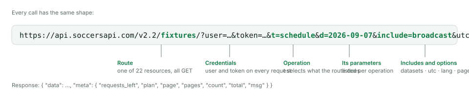

# Soccer's API

**Soccer's API** is a REST API for football data: live and scheduled matches,
events, lineups, statistics, odds, TV broadcasts and the entities behind them,
for close to a thousand competitions. What an account can read depends on its
plan and on the coverage of each competition; see
[Plans and Data Access](./08-plans-and-access.md).

Every call has the same shape: a route, your credentials, a `t` parameter that
selects the operation, and the parameters of that operation.



```bash
curl -L -g "https://api.soccersapi.com/v2.2/leagues/?user={{USERNAME}}&token={{TOKEN}}&t=info&id=1005"
```

Responses carry `data` and `meta`. `meta` reports the request allowance and
the pagination, and on errors the reason.

## Where to go next

- [Getting Started](./01-getting-started.md): account, token and first call.
- [Shared Query Parameters](./02-shared-query-parameters.md): pagination,
  includes, `utc` and `lang`.
- [Data Model](./03-data-model.md) and [The Match Object](./05-match-object.md):
  how entities relate and what a match looks like.
- [Recipes](./09-recipes.md): call sequences for a livescore screen, a
  where-to-watch page, odds, competition and team pages.
- [Plans and Data Access](./08-plans-and-access.md),
  [Errors and Request Limits](./10-errors-and-rate-limits.md) and
  [Statuses](./06-statuses.md).
- The reference below: every route with its operations, parameters, captured
  examples and an interactive client.

## Coverage and completeness

A successful response can contain an empty array or `null` fields: access and
field availability depend on the plan, on the coverage of the competition and
on what the source has published for the match. Live scores and their event
attribution can arrive at different times and may be corrected or backfilled,
so merge newer snapshots instead of assuming the first update is final.
